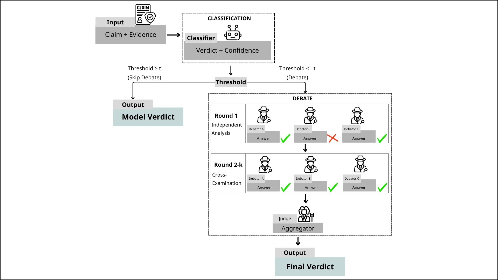

# ViFactCheck MAD

ViFactCheck MAD is a research-engineering project for Vietnamese fact verification that combines a pretrained language model (PLM) routing gate with a configurable multi-agent debate system. The goal is to keep the strong efficiency of a single classifier on easy examples while escalating uncertain cases to a debate council and a final judge.

The current experimental setting uses `Statement + Evidence` from the ViFactCheck dataset and predicts one of three labels: `Support`, `Refute`, or `NEI`.

## Architecture



The figure is a schematic overview of the hybrid routing idea; the completed experiments in this repository currently use the `gold_evidence` setting rather than a full-context setup.

At a high level, the system works as follows:

1. A PLM predicts a label and confidence score for the input claim-evidence pair.
2. In **hybrid mode**, confident predictions skip debate and become the final output.
3. Uncertain cases are sent to a configurable debate panel with `N ∈ {2, 3, 4}` debaters and `k ∈ {3, 5}` rounds.
4. Early stopping is allowed when the panel becomes unanimous.
5. A judge model is still called after debate to synthesize the final verdict.

## Dataset and Task

- **Dataset**
  - `tranthaihoa/vifactcheck`
  - Total samples: `7,232`
  - Splits: train `5,060`, dev `723`, test `1,447`
- **Labels**
  - `Support`
  - `Refute`
  - `NEI`
- **Current input mode**
  - `gold_evidence` (`Statement + Evidence`)

## Experiment Scope

### PLM candidates

- **PhoBERT-base**: `vinai/phobert-base`
- **XLM-R-base**: `xlm-roberta-base`
- **mBERT**: `bert-base-multilingual-cased`
- **ViBERT**: `FPTAI/vibert-base-cased`

### Debate panel

- **Debaters**
  - `mistralai/mistral-small-2603`
  - `openai/gpt-4o-mini`
  - `qwen/qwen-2.5-72b-instruct`
  - `meta-llama/llama-3.3-70b-instruct`
- **Judge**: `deepseek/deepseek-chat`
- **Provider**
  - OpenRouter

### Modes

- **PLM benchmark**
  - Fine-tune and evaluate standalone encoders.
- **Full debate**
  - Every sample goes through the debate council and judge.
- **Hybrid debate**
  - A routing gate sends only low-confidence samples to debate.
- **Threshold sweep**
  - Evaluate routing thresholds on the dev set before fixing the global hybrid threshold.

## Results Snapshot

### Standalone PLM benchmark

| Model | Macro F1 |
|---|---:|
| PhoBERT-base | 0.8508 |
| XLM-R-base | 0.8160 |
| mBERT | 0.7974 |
| ViBERT | 0.7079 |

PhoBERT is the best-performing PLM in this project and is used as the routing gate in hybrid debate.

### Main takeaways from completed test experiments

| Finding | Configuration / Model | Macro F1 | Efficiency Notes |
|---|---|---:|---|
| Strongest single-agent baseline | Qwen-2.5-72B | 0.8788 | AC = 1 |
| Best judge-only baseline | DeepSeek judge-only | 0.8706 | AC = 1 |
| Best full-debate configuration | `N=3, k=3` | 0.8690 | AC = 4.91 |
| Best hybrid configuration | `N=4, k=5` | 0.8771 | AC = 0.94, DSR = 88.6% |
| Routing policy | Global threshold `t = 0.85` | — | Shared across hybrid configs for consistent comparison |

These results suggest that the hybrid design preserves near-best quality while using far fewer agent calls than always-debate configurations.

## Repository Structure

```text
FactChecking/
├── src/
│   ├── api/                     # OpenRouter client wrappers
│   ├── config/experiments/      # YAML configs for PLM, full, hybrid, sweep
│   ├── data/                    # Raw, preprocessing, preprocessed data
│   ├── models/                  # PLM model, optimizer, training, evaluation
│   ├── orchestrator/            # Debate engine, routing gate, runners
│   ├── outputs/                 # Metrics, logs, visualizations
│   └── utils/                   # Shared constants and helpers
├── requirements.txt
└── README.md
```

## Getting Started

### Requirements

- **Python**
  - `3.10+`
- **Recommended hardware**
  - CUDA-enabled GPU for PLM fine-tuning
- **External API**
  - OpenRouter API key for debate and judge runs

### Installation

```bash
python -m venv .venv
source .venv/bin/activate
pip install -r requirements.txt
```

On Windows PowerShell, activate the environment with:

```powershell
.\.venv\Scripts\Activate.ps1
```

### Environment variables

Create a `.env` file from `.env.example` and set:

```env
OPENROUTER_API_KEY=your_key_here
```

## Usage

All major workflows are routed through `src/main.py`.

### 1. Download the dataset

```bash
python -m src.main --phase download
```

### 2. Preprocess all model inputs

```bash
python -m src.main --phase preprocess
```

### 3. Train all PLM baselines

```bash
python -m src.main --phase train-all
```

### 4. Evaluate all PLM checkpoints

```bash
python -m src.main --phase eval-all
```

### 5. Run one hybrid debate configuration

```bash
python -m src.main --phase debate --config src/config/experiments/hybrid/mad_n4_k5_hybrid_gold_evidence.yaml
```

### 6. Run all configs in a directory

```bash
python -m src.main --phase debate-all --configs-dir src/config/experiments/hybrid --parallel 1
```

### 7. Generate cross-config summaries and plots

```bash
python -m src.main --phase analyze --debate-mode full
python -m src.main --phase analyze --debate-mode hybrid
```

## Metrics Reported

- **Primary metric**
  - Macro F1
- **Per-class quality**
  - F1 for `Support`, `Refute`, and `NEI`
- **Efficiency**
  - Average Agent Calls
  - Debate Skip Rate
  - Average actual rounds used
- **Routing quality**
  - Routing false-positive and false-negative rates
- **Behavior analysis**
  - Verdict flip rate
  - Error propagation

## Project Status

- **Completed**
  - Data pipeline
  - PLM benchmark training and evaluation
  - Full-debate and hybrid-debate test runs
  - Threshold sweep and routing policy selection
- **In progress**
  - Additional analysis artifacts such as confusion matrices and paper summary tables

## Notes

- This repository currently focuses on the `gold_evidence` setting.
- Debate panel composition and routing behavior are controlled through YAML configs rather than hardcoded logic.
- PhoBERT requires PyVi-based word segmentation, while the other encoder baselines use raw text tokenization.

## References

- **ViFactCheck dataset**: https://huggingface.co/datasets/tranthaihoa/vifactcheck
- **ViFactCheck paper**: https://ojs.aaai.org/index.php/AAAI/article/view/32008
- **PhoBERT**: https://aclanthology.org/2020.findings-emnlp.92/
- **Debate Only When Necessary**: https://arxiv.org/abs/2504.05047
